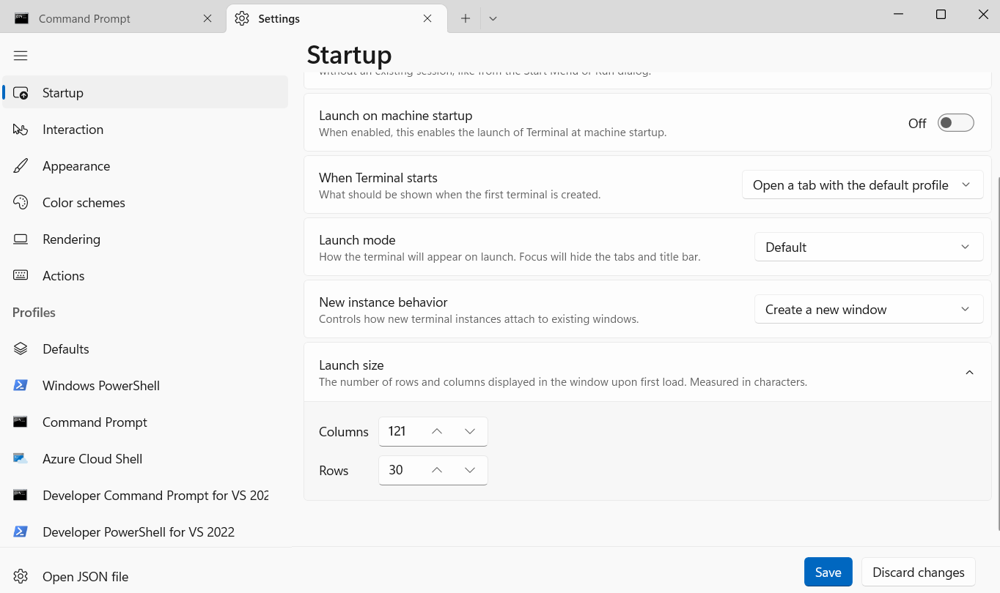

# Console Rotation Cube C++

This approach in C++ works in **Windows only**

Developed with Cmake in Clion

To be visualized correctly the console size in Windows was set to:

- Columns: 121
- Rows: 30

## Sources of Error
1. Ideally the console dimensions should match the dimensions in line 40 of the main.cpp file but Windows11 had issues with it. Try to adjust the width manually until you get it right.

2. If character display isn't working correctly, the library "cstdint" should be used instead for the type of declared variables.
Sometimes the CPU architectures may change the number of bits used for char and int variables.

## Sample
Please feel free to use it. Cite this repository if used.

